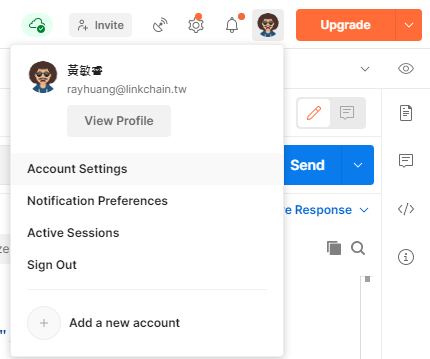
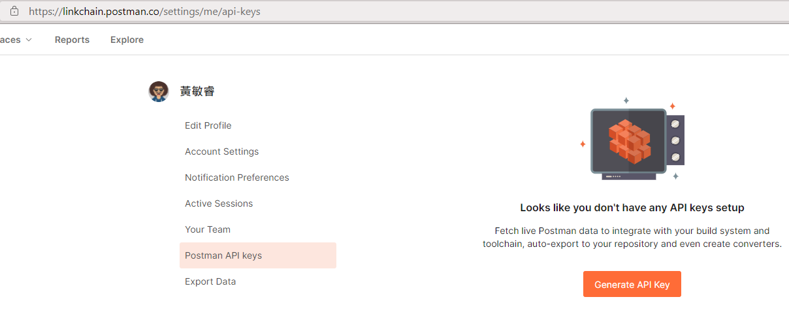
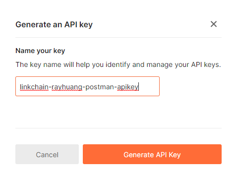
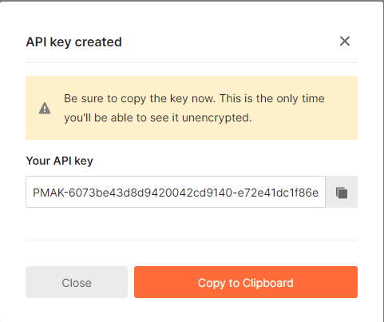
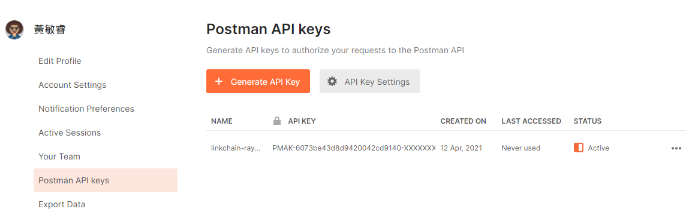

# **PostmanAPI 同步機制**

**`Postman`** 是很好用的 HttpRequest 工具，個人使用沒有限制，但它的多人協作方案（Team，Business，Enterprise）是用 `user/month` 計費...太貴了...$_$

貧窮限制了我們的生產力，只好寫更多 Code 來彌補了！

此同步機制，使用 `Postman API` + `Nodejs` + `Git` 達成近似雲端協作的效果

---

## **Getting Started**

### **1. 取得API Key**

* 打開Postman應用程式 --> UserProfile Icon --> Account Settings

    

* Postman API keys --> Generate API Key

    

* 輸入任意識別名稱

    

* 產生成功，把 Key 複製起來，貼到 `.env` 中

    
    

### **2. 安裝與設定**

* 安裝相依套件

    ```sh
    npm install
    ```

* 將 `.env.example` 複製並更名為 `.env`

    ```sh
    cp .env.example .env
    ```

* 把Step1中取得的API Key貼到 `.env` 中

    ```sh
    POSTMAN_APIKey=貼上你的APIKey
    TEAM_WORKSPACE_NAME=Team LinkChain
    ```

---

## **How to Use**

* 匯入

    ```powershell
    npm run import
    ```

* 匯出

    ```powershell
    npm run export
    ```

* 同步

    ```sh
    git pull
    .
    .
    .
    git push
    ```
